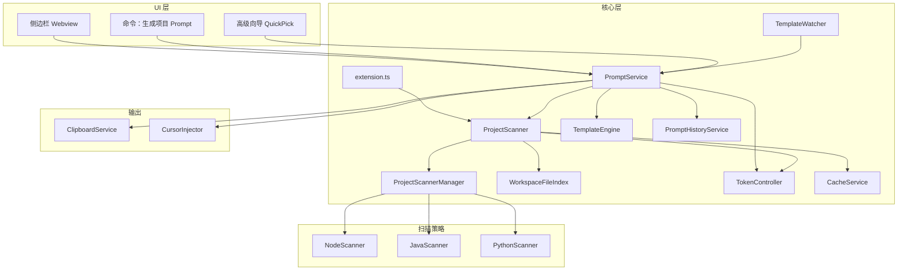

# Project Prompt Pro — 技术架构

## 1. 总体架构



## 2. 模块职责

| 模块 | 路径 | 职责 |
|---|---|---|
| 入口 | `extension.ts` | 激活、命令注册、模板热重载 |
| 扫描管理 | `scanner/strategies/ProjectScannerManager.ts` | 策略模式调度 Node/Java/Python |
| Node 策略 | `scanner/strategies/NodeScanner.ts` | package.json + stack-rules |
| Java 策略 | `scanner/strategies/JavaScanner.ts` | pom.xml / build.gradle |
| Python 策略 | `scanner/strategies/PythonScanner.ts` | requirements.txt / pyproject.toml |
| 文件索引 | `scanner/WorkspaceFileIndex.ts` | fast-glob + vscode.workspace.findFiles |
| 扫描编排 | `scanner/ProjectScanner.ts` | 产出 `ProjectContext` |
| Token | `token/TokenController.ts` | 智能截断（目录树 → 代码 → devDeps） |
| 模板 | `template/TemplateRegistry.ts` | 内置 / 工作区 / 团队 JSON |
| 渲染 | `template/TemplateEngine.ts` | Mustache 变量 / 条件 / 循环 |
| 热重载 | `template/TemplateWatcher.ts` | 监听 `.vscode/project-prompt-templates.json` |
| 服务 | `services/PromptService.ts` | 扫描 + 渲染 + 复制/注入 |
| 集成 | `integration/CursorInjector.ts` | setInput / 粘贴 / Markdown 降级 |
| 关键词匹配 | `matcher/RelevanceMatcher.ts` | 需求 → 相关文件 |
| AI | `ai/AiService.ts` | DeepSeek / OpenAI Provider |
| Assist | `ai/AssistService.ts` | LLM 精炼 Prompt |
| Agent | `ai/AgentOrchestrator.ts` | MCP 多轮分析 |
| MCP | `mcp/McpToolRegistry.ts` | 内置 + 外部 MCP 工具 |

## 3. 数据流

```
用户点击「生成 Prompt」
  → 获取工作区路径
  → 并行：WorkspaceFileIndex 列文件 + ProjectScannerManager 识别技术栈
  → 组装 ProjectContext
  → TokenController.smartTruncate（默认 50K 预算）
  → TemplateEngine 渲染（Mustache）
  → TokenController.applyPromptBudget
  → Webview 预览 / 复制 / 注入 Cursor
```

## 4. 扫描流水线

```
合并排除规则 → WorkspaceFileIndex（vscode API 或 fast-glob）
→ ProjectScannerManager（Node / Java / Python 策略）
→ FileWalker.buildTree + detectArchitecture
→ CodeSampler → TokenController.smartTruncate → 缓存 → ProjectContext
```

## 5. Token 截断优先级

1. 目录树深度 ≤ 3
2. 代码片段仅保留第一个
3. 移除 devDependencies
4. 结构树字符截断

## 6. 模板优先级

1. `.vscode/project-prompt-templates.json`
2. `.project-prompt-pro/templates/{id}.md`
3. `resources/templates/{id}.md`

Mustache 扩展：`{{#if react}}` `{{#each deps}}`

## 7. 构建

```bash
npm run compile   # esbuild → dist/extension.js
npm run test      # 无 VS Code 环境的 headless 测试
npm run package   # .vsix
```

## 8. 生成模式

```
prompt-only → 扫描 + 模板 + 关键词匹配（纯本地）
assist      → 上述 + LLM 精炼 Prompt
agent       → MCP 工具多轮分析 → 改造方案 + 推荐 Prompt
```

用户文档见仓库根目录 [README.md](../README.md)。
